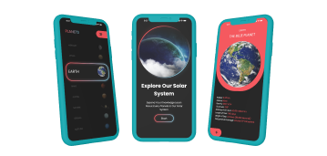

<!DOCTYPE html>
<html lang="en">
<head>
    <meta charset="UTF-8">
    <meta name="viewport" content="width=device-width, initial-scale=1.0">
    <link rel="stylesheet" href="style.css"/>
    <title>Youssef | Software Engineer</title>
</head>

<body>

    <header class="header">
        
        <nav class="navigation">
            <ul>
                <li><a href="#aboutme">About Me</a></li>
                <li><a href="#myworks">My Works</a></li>
                <li><a href="#contactme">Contact Me</a></li>
            </ul>
        </nav>
    </header>

    

    <section class="hero">
        

            
            <h1 class="name">I'm Youssef</h1>
            <h1 class="title">Software Enginner</h1>
            
            

                <a class="hireme" href="mailto:tohyyoussef@gmail.com">Contact</a>
                <a class="cv" href="service(en).pdf" target="_blank" rel="noopener noreferrer">
                    About My Business
                    
                </a>
            

        

        
    </section>

    <section class="aboutme" id="aboutme">
        
        

            

                <h1 class="aboutname">About </h1>
                <h1 class="abouttitle">me</h1>
                
        

        

         Hey, I'am Youssef, I develop complete, modern, and high-performance websites from scratch. Driven by continuous growth, my focus is on turning complex logic and ideas into clean, intuitive, and visually sharp user experiences that deliver real value.
         

        

    </section>

    <section class="works" id="myworks">
        

            

                <h1 class="aboutname">My recent</h1>
                <h1 class="abouttitle">Works</h1>
            

            <ul>
                <li>
                    
                </li>

                 <li>
                     <a href="">
                 </li>
                 <li>
                    <a href="">
                 </li>
            </ul>
        

    </section>

</body>
</html>
